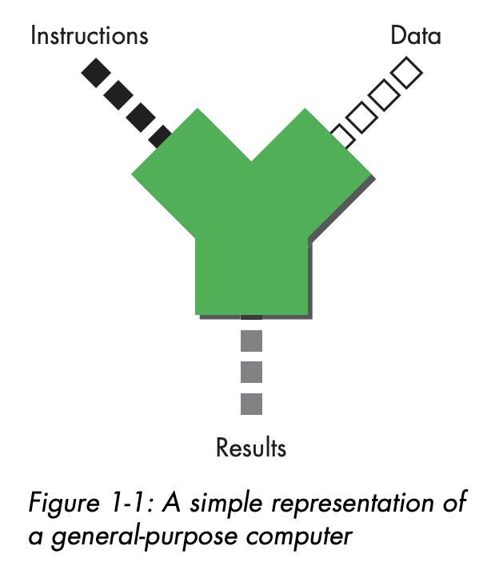
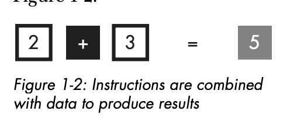
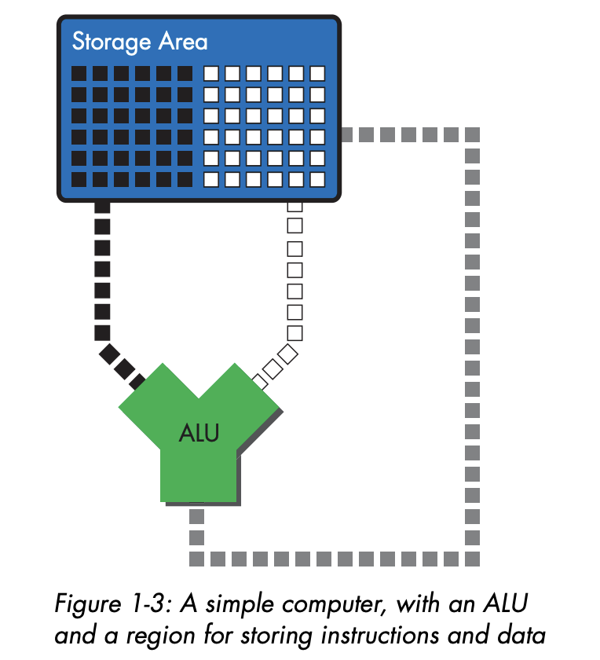
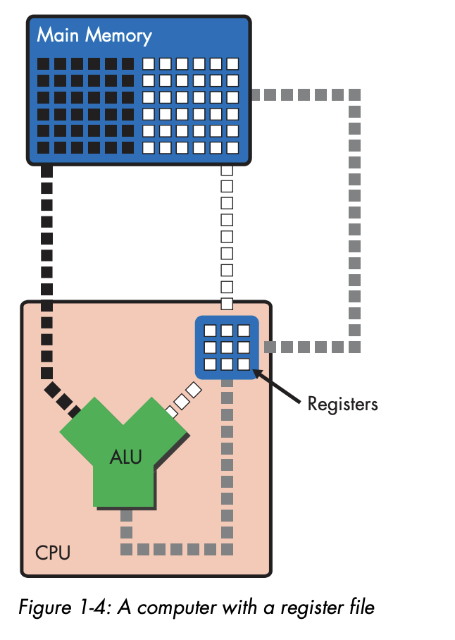
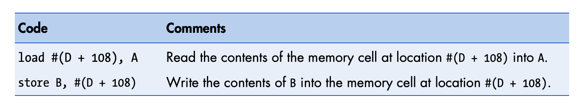

# Basic Computing Concepts

The one that runs the computer is microprocessor, or we call it CPU.

Inside the CPU, there's a lot of microscoping network gates (transistor), and channels (wires or lines).

## The Calculator Model of Computing

Basically, computer takes instruction of code and stream of data as input, and produces stream of result as an output.

Code stream consist of different type of arithmetic operations. 

Data stream consist of data that want to operate.

Result stream made up of the result of these operation.





## The File-Clerk Model of Computing

Calculator may be useful, but if you see the definition of computer: 

```
A computer is a device that shuffles numbers around from place to place, reading, writing, erasing, and rewriting different numbers in different locations according to a set of inputs, a fixed set of rules for processing those inputs, and the prior history of all the inputs that the computer has seen since it was last reset, until a predefined set of criteria are met that cause the computer to halt. 
```

In nutshell, computer is just a device that reads, modifies, and write sequences of numbers.

Those 3 instruction are the most fundamental function on computer.

All computer need to have these fundamental structures to be able to do read, modify, write.

### Storage

Read and Write from / to where? Storage.

### Arithmetic logic unit (ALU)

Computer "modify" something means it performs operation to number. ALU will do matemathical action like addition, subtraction, etc.

First, number read from storage into ALU data input port. Once inside ALU, it got executed, after that it will go to storage again via ALU data output port.

### Bus

In order to move number between ALU and storage, we need Bus. ALU read and write data to storage is using data bus. Instruction go to ALU is using instruction bus.

Data stream from storage through data bus

How about instruction? Where it did come from?



Turns out the place is the same, from storage also, but in special storage area.

### Refining the File-Clerk Model

Let's do an example, the code stream consist a single instruction `ADD`, which tell ALU to add two number.

`ADD` instruction travel from code storage to ALU. Let's just assume `ADD` instruction show up in ALU input port, ALU will do something like this.

- Obtain 2 number from data storage
- Add the numbers
- Place the result back into data storage

## The Register File

Since ALU is a part of processor, we want to place the storage also near processor, so it can read operand almost instant.

These storage location is called register, first `x86` computer has 8 of them in processor.

These register called register files. Can only store small subset of data and code.

Here's what it does now

- Obtain two number from source register
- Add the number
- Place the result in destination register.

## RAM: When Registers Alone Won’t Cut It

8 Register isn't enough to accomodate infinite storage space.

This is the main memory comes in, RAM (Random Access Memory).



ALU and register are internal part of the CPU.

Transfering main memory to ALU takes significant amount of time.

### An Example: Adding Two Numbers

- Load two operand from main memory into two source register
- Add content of source register and place the result in destination register.
    - Read the content of register A and B into ALU input port
    - Add content A and B in the ALU
    - Write result to register C through ALU output port
- Store the content of the destination register into main memory.

## A Closer Look at the Code Stream: The Program

Computer list of instruction is not limited on mathematical instruction.

### General Instruction Types

In RISC microprocessor, act of moving data between memory and register is under explicit control of code stream also.

That means, program must consist of

`Load` instruction to move number between memory to register
`Add` instruction to add 2 number on register using ALU
`Store` instruction to move number from register to memory.

## A Closer Look at Memory Accesses: Register vs. Immediate

### Immediate Values

When doing Add, we can do with 2 register. But we can also add with immediate value.

`add A, 2, A` this means add 2 on A.

### Register-Relative Addressing

We can access address using base and offset

`base address + offset`



By using this instead of hardcoding the address, programmer can access the address without know exactly where's the address.