# The mechanics of program execution

## Opcodes and Machine Language

Both memory address and instruction is basically just a number that can be stored in memory.

Program is just a series of long string of number stored in memory.

### Machine Language on the DLW-1

English word instruction like `LOAD`, `ADD`, `STORE` are basically just mnemonic for us. They are mapped to binary number called opcodes.

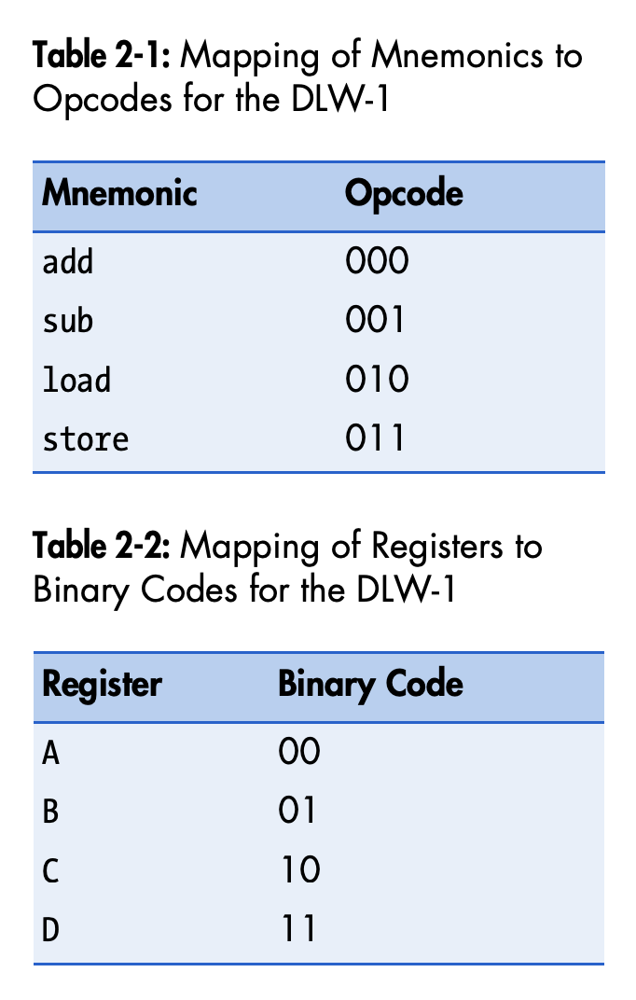

### Binary Encoding of Arithmetic Instructions


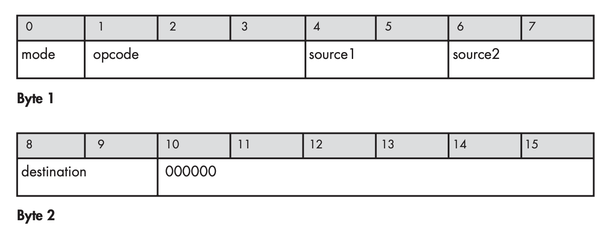

Mode is either 1 or 0.

If mode 0, that means it's register type instruction

If mode 1, that means it's immediate type

So that means if you want to do 

```
add A, B, C
```

It will be 
```
00000001 10000000

0 (mode) 000 (add) 00 (A) 01 (B) 10 (C) 000000 (Padding)
```

Let's see for immediate mode

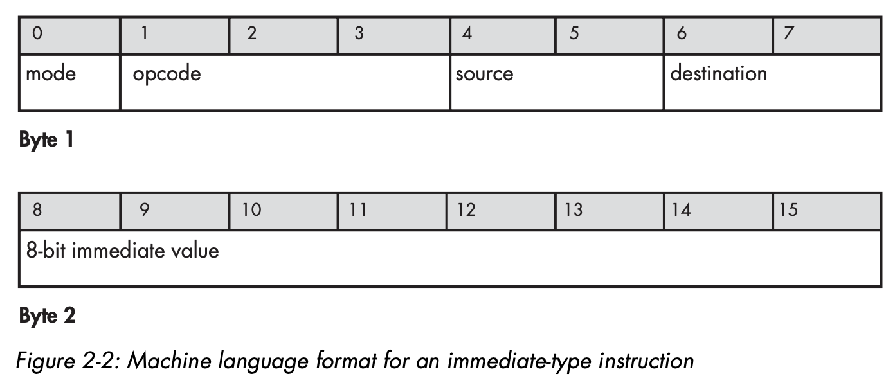

That means, if you want to do

```
add C, 8, A
```

It will be 
```
10001000 00001000

1 (mode) 000 (add) 10 (C) 00 (A) 00001000 (8)
```

Let's another example
```
add 5, A, C
```

It will be
```
10000010 00000101

1 (mode) 000 (add) 00 (A) 10 (C) 00000101 (5)
```

Let's try 1 more time

```
sub 25, D, C 
```

It will be
```
10011110 00011001

1 (mode) 001 (sub) 11 (D) 10 (C) 00011001 (25)
```

### Binary Encoding of Memory Access Instructions

#### Load instruction

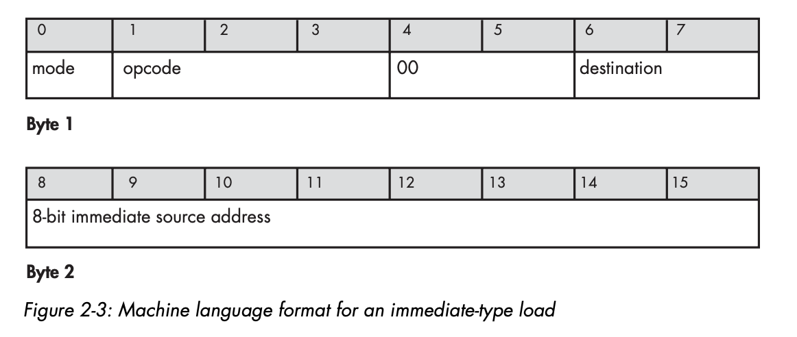

That means, if we want to do

```
load #12, A
```

The binary will be
```
10100000 00001100

1 (mode) 010 (load) 00 (padding) 00 (A) 00001100 (12)
```

For load from register to another register, we do

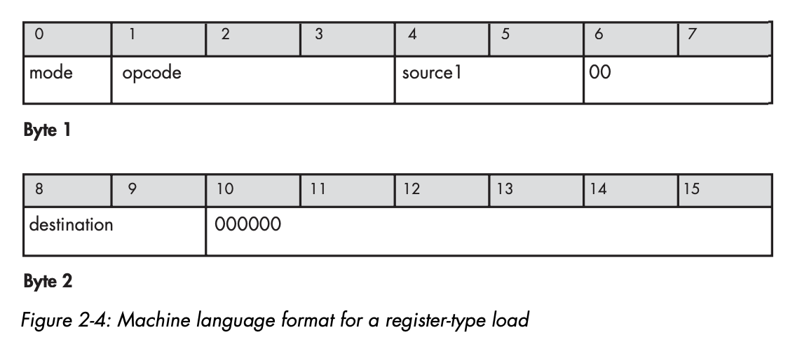

For load from register relative offset, we do

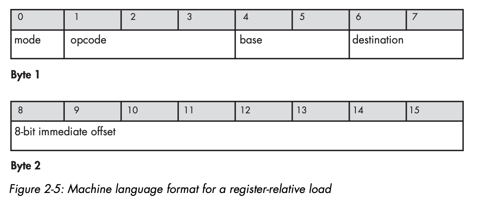

#### The store instruction

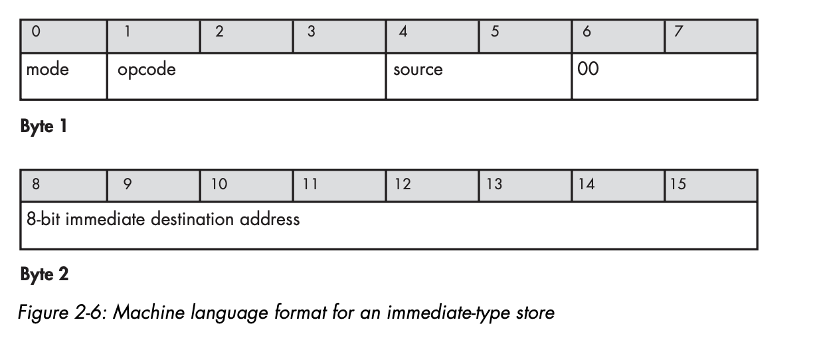


### Translating an Example Program into Machine Language

Example

```
load #12, A
```

Will be
```
10100000 00001100

1 (mode) 010 (load) 00 (padding) 00 (A) 00001100 (12)
```

```
load #13, B
```

Will be
```
10100001 00001101

1 (mode) 010 (load) 00 (padding) 01 (B) 00001101 (13)
```

```
add A, B, C
```

Will be
```
00000001 10000000

0 (mode) 000 (add) 00 (A) 01 (B) 10 (C) 000000 (padding)
```

```
store C, #14
```

Will be
```
10111000 00001110

1 (mode) 011 (store) 10 (C) 00 padding 00001110 (14)
```

## The Programming Model and the ISA

Long time ago, programmer must enter the program into the computer directly using machine language.

This was done by flippiing switches.

Then, computer scientist tried to make something that more user friendly. That's assembly.

In order to make assembly program, you have to understand the machine available resources such as how many register it has, what instruction it support, etc.

### The Programming Model

#### The Instruction Register and Program Counter

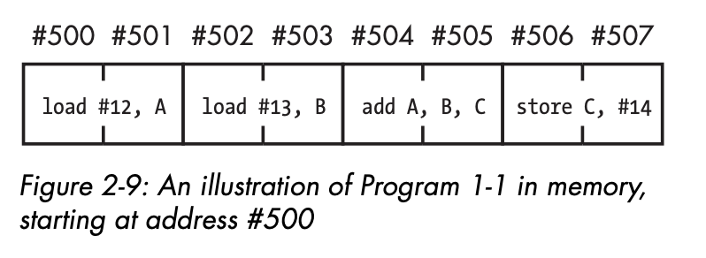

Because each instruction need 2 byte, the illustration of instruction looks like this

#### The Instruction Fetch: Loading the Instruction Register

Instruction fetch is a special type of instruction that run every time the instruction is finished.

It takes the address from program counter register, and put it into instruction register as the destination.

The instruction is decoded first before being executed.

While the instruction being decoded, processor increase the address of program counter so it will fetch next instruction after it finished with this instruction.

In DLW-1 machine computer, it will increment by 2, because the byte it needed for 1 instruction is 2 byte.

#### Running a Simple Program: The Fetch-Execute Loop

Let's look the step it takes to feed the instruction into ALU or memory access hardward.

- Fetch next instruction from address stored in program counter, and load that instruction into instruction register. Then increment the address
- Decode the instruction in instruction register.
- Execute the instruction in the instruction register, using this rules
    - If the instruction is an arithmetic instruction, execute it using ALU and register file
    - If the instruction is an memory access, execute it using memory access hardware.

## The Clock

This 3 step is actually done in 1 clock beat.

One obvious way to speed up the execution of the instruction is to speed up it's clock generator.

## Branch Instructions

### Unconditional Branch

It consist 2 part, branch instruction and target.

```
jump #target
```

`#target` can either immediate value, or value from register.

### Conditional Branch

This almost like unconditional branch, but it need to meet some kind of condition to be able to jump.

Because of this, we need some kind of special register to store information about condition we need to check.

Different architecture handle it differently, but in DLW-1, there's a processor status word (PSW) register.

It will check the value in PSW if the condition is true or not. If the condition is true, then the control unit replaces the address in the program counter with the branch target address.

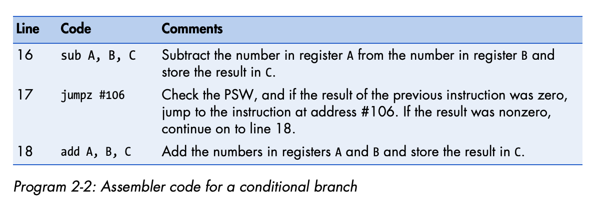

### Branch Instructions and the Fetch-Execute Loop

Now, the fetch execute loop will become like this

- Fetch next instruction from address stored in program counter, and load that instruction into instruction register. Then increment the address
- Decode the instruction in instruction register.
- Execute the instruction in the instruction register, using this rules
    - If the instruction is an arithmetic instruction, execute it using ALU and register file
    - If the instruction is a memory access, execute it using memory access hardware.
    - If the instruction is a branch instruction, then execute it using control unit and program counter (Write the branch address into program counter if condition is fulfilled)

### The Branch Instruction as a Special Type of Load

Instruction fetch is actually like a regular load. That means the fetch address can be from register.

This is useful because programmer don't need to know where exactly the code is.

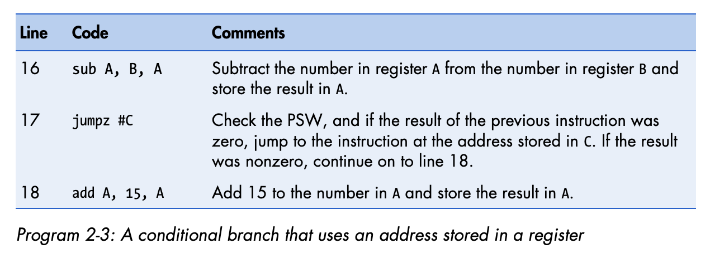

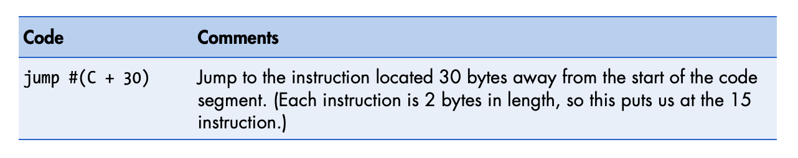

#### Branch Instructions and Labels

Usually for jump instruction, the developer use label instead of putting the real address

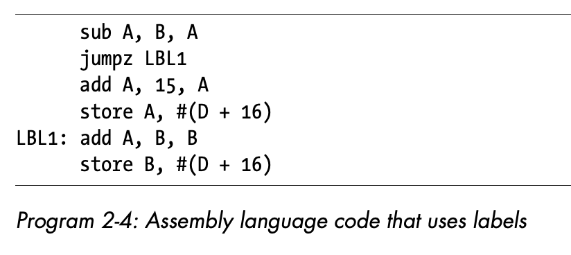

## Excursus: Booting Up

Computer do boot up means the intial state or powering up computer.

Term boot is from bootstrap, which means it's an impossible task for computer to do it.

It's called impossible because when first time computer is powered on, there's no program in memory.

But program contains the instructions that make computer runs.

How does computer know where to fetch if there's no instruction can be fetch?

Solution for that is, when it's power on, it's hard wired to fetch the first instruction from predetermined address in memory.

First instruction which will be loaded into processor instruction register, first line of program is called a BIOS, it's located in ROM (Read only memory).

BIOS will do basic test of RAM and some other devices to make sure everything is doing correctly.

At the end of BIOS program, there will be a jump instruction, the target will be to bootloader program.

Bootloader will search and load computer OS from hard disk.

Then OS will load and unload the program.