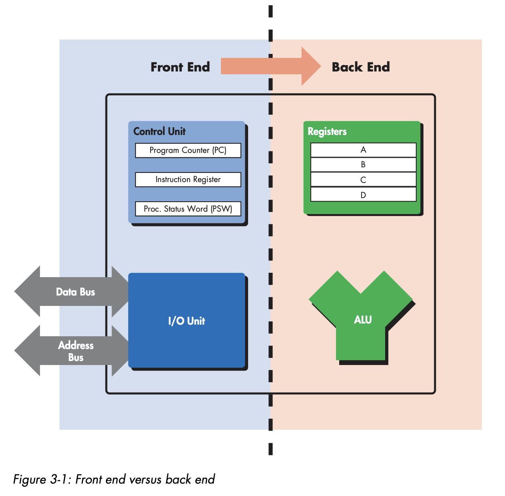
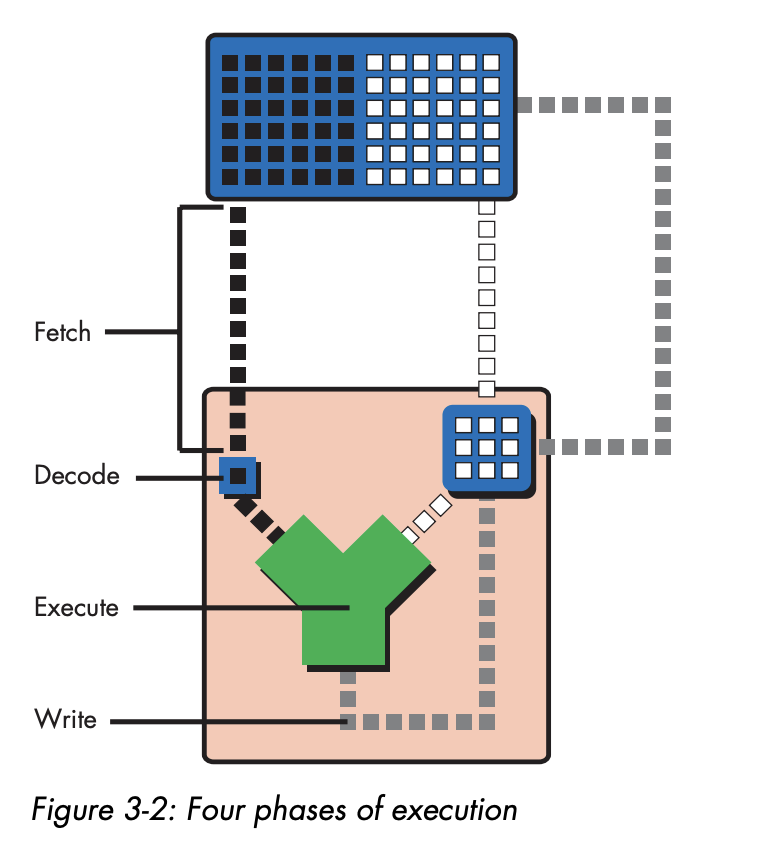
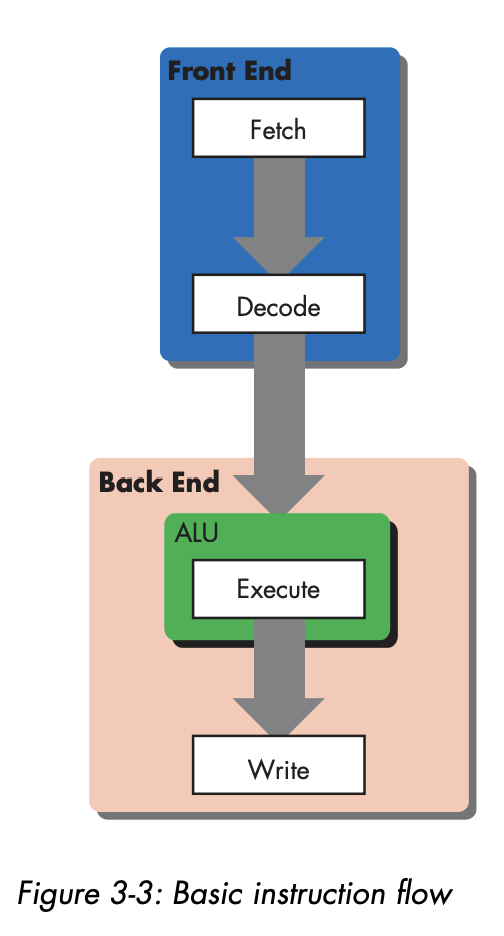
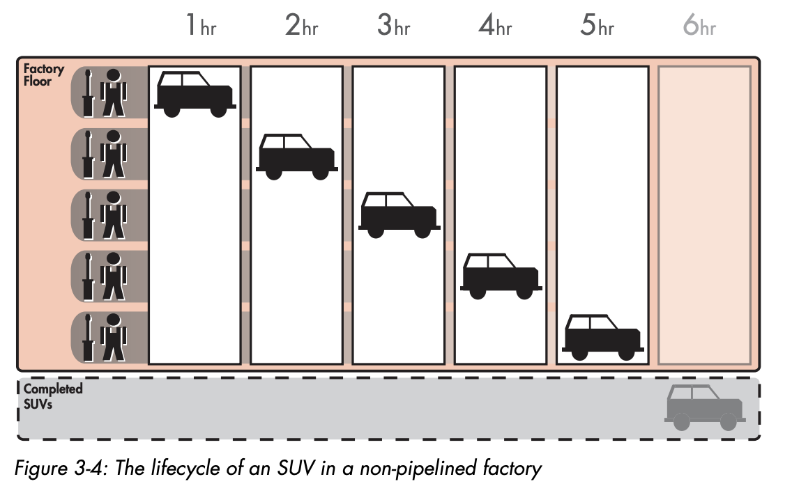
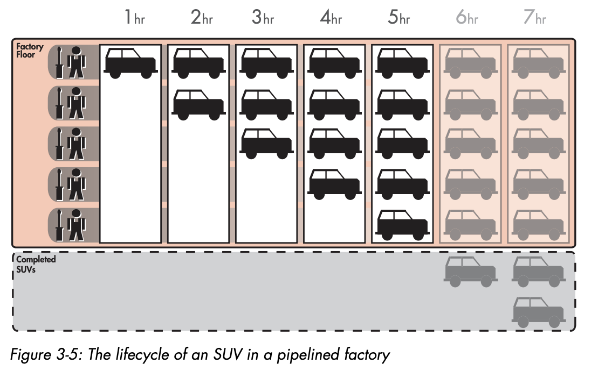
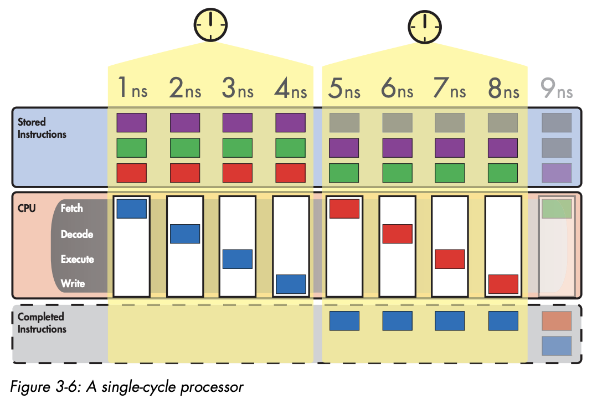
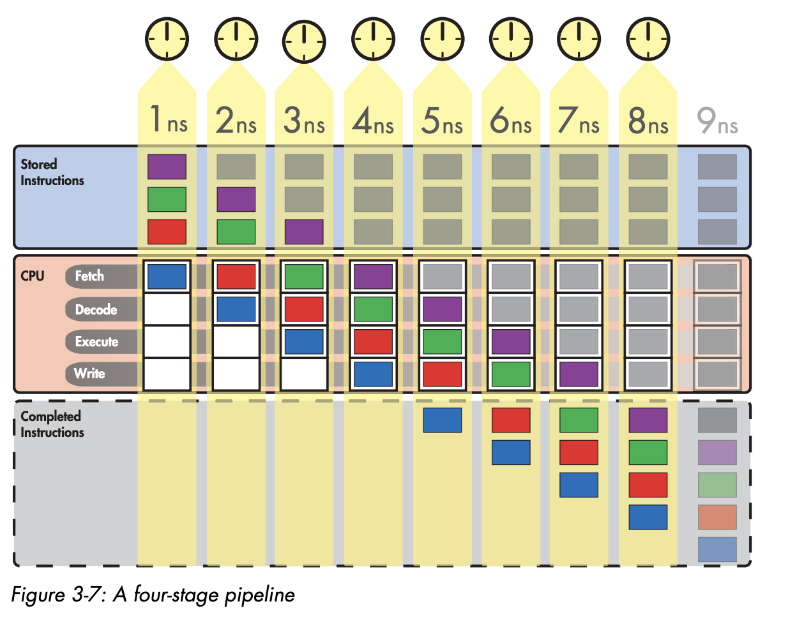

# Pipelined Execution

Pipelined execution is a technique to increase the processor performance.

## The Lifecycle of an Instruction

In previous chapter, we learned 3 basic step of executing a program

- Fetch the next instruction, load the instruction to instruction register, increment the program counter
- Decode the instruction in instruction register
- Execute the instruction in instruction register

We should remember in execute step, it can consist of multiple sub step, depending of type instruction.

For example like ADD A, B, C

- Read contents from register A and B
- Add the contents A and B
- Write the result back to C

That means it will like this

- Fetch the next instruction, load the instruction to instruction register, increment the program counter
- Decode the instruction in instruction register
- Execute the instruction in instruction register
    - Read contents from register A and B
    - Add the contents A and B
    - Write the result back to C

But we need to revise this, the process is actually modified like this

- Fetch the next instruction, load the instruction to instruction register, increment the program counter
- Decode the instruction in instruction register
- Execute the instruction in instruction register
    - Read contents from register A and B
    - Add the contents A and B
- Write the result back to C

So it's not 3, it's actually 4 in classic RISC pipeline.

- Fetch
- Decode
- Execute
- Write (or write-back)

All four phase usually take the same amount of time, that means if it's take 1ns, then it will finish 1 instruction in 1ns

## Basic Instruction Flow

In CPU, there's a frontend and backend.

When instruction is fetched from main memory, they must be decoded for execution, the fetching and decoding happens in the frontend.



As you can see, frontend is related to control and I/O unit.

The ALU and registers related to backend.





## Pipelining Explained

Assuming there's an automotive manufacturing business that want to build a SUV car.

This is the stages of building it.

1. Build the chassis
2. Drop the engine into the chassis
3. Put the doors, a hood, and covering on the chassis
4. Attach the wheels
5. Paint the SUV

Each of this step is done by trained worked, each worker only can do one step. They don't know how to do any 4 other steps.



Then, a lot of demand happen. Maybe in 1 day there will be 100 SUV request.

Instead of worker 1 not doing anything when the car is building. We can just let the worker 1 build the chassis.



Now there will be no more idle worker in our factory.

## Applying the Analogy

### A Non-Pipelined Processor

With non pipelined approach, and assuming 1 instruction = 1 clock cycle.

That means we can only do
0.25 instruction / ns



Single cycle processor is simple to design, but they waste a lot of hardware resources.

By doing pipelining, we wont let any step idle.

### A Pipelined Processor

If we change it into pipelining approach, the result will be like this



As you can see, at 8ns time, we finished 4 instruction. That's 0.5 instruction / ns

### The Speedup from Pipelining

In general, the amount of speed up from pipelining is based on the number of step.

In previous example is fourfold speedup. If we have 6 step, that means is sixfold speedup.

Because of that, if we make the step a lot more, we can speed up it.

Let's back again to SUV step.

1. Build the chassis
    - Fit the parts of the chassis together and spot-weld the joints
    - Fully weld all the parts of the chassis.
2. Drop the engine into the chassis
    - Place the engine into the chassis and mount it in place.
    - Connect the engine to the moving parts of the car.
3. Put the doors, a hood, and covering on the chassis
    - Put the doors and hood on the chassis.
    - Put the other coverings on the chassis.
4. Attach the wheels
    - Attach the two front wheels
    - Attach the two rear wheels.
5. Paint the SUV
    - Paint the sides of the SUV
    - Paint the top of the SUV.

That means, it will be 10 steps. That means instead of fivefold improvement, we will get tenfolds improvement.

### Program Execution Time and Completion Rate

```
program execution time = number of instructions in program / instruction completion rate
```

From this equation, we can reduce it in two ways.

By reducing the number of instruction per program, or increasing processor completion rate.

### The Relationship Between Completion Rate and Program Execution Time

