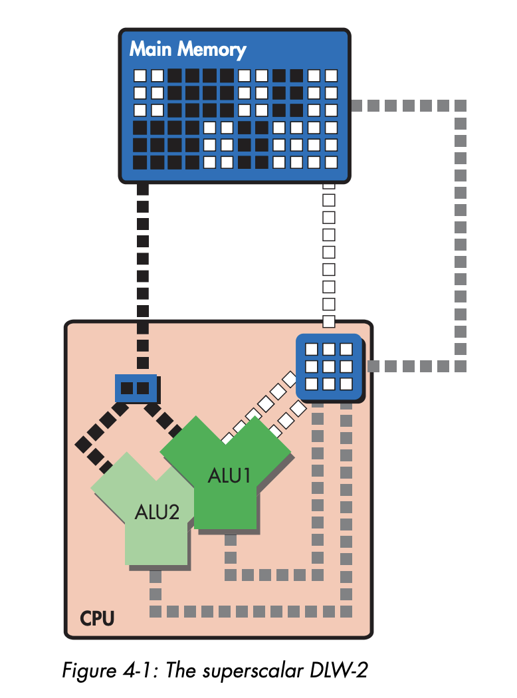
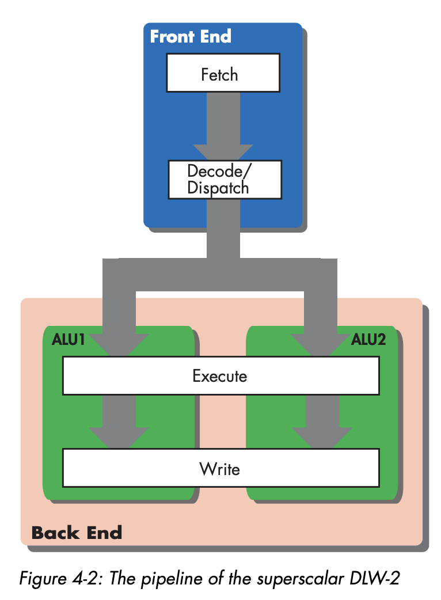
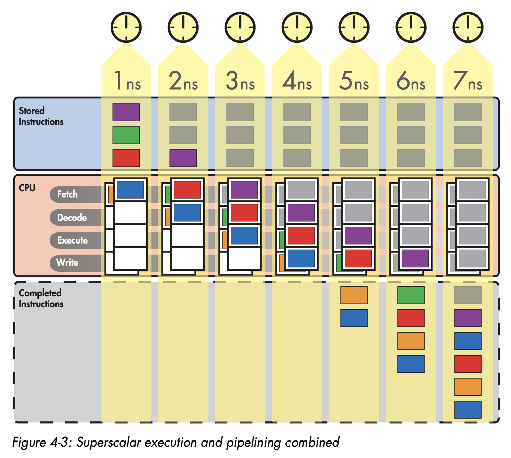
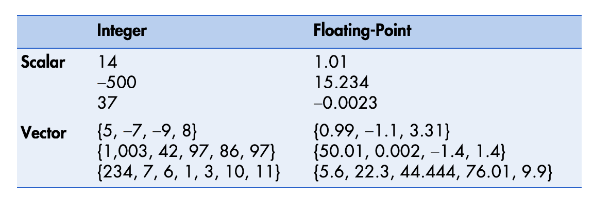
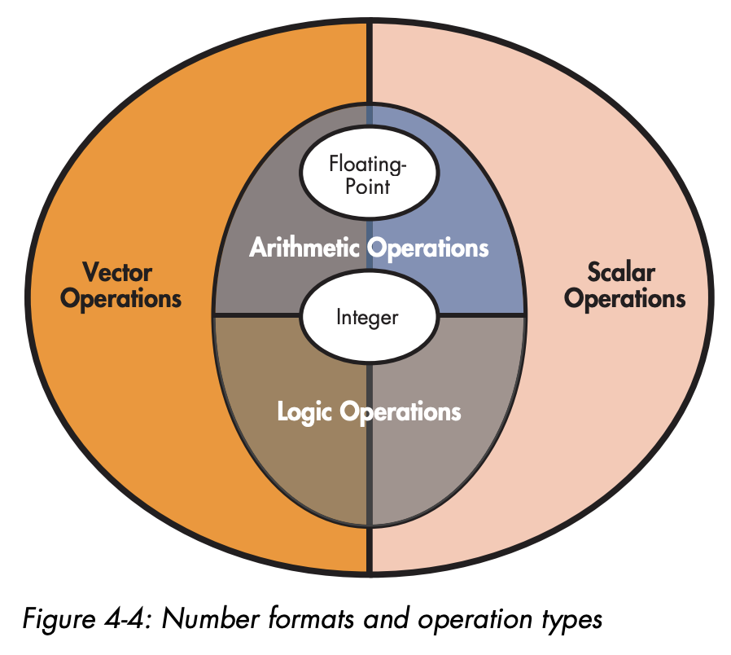
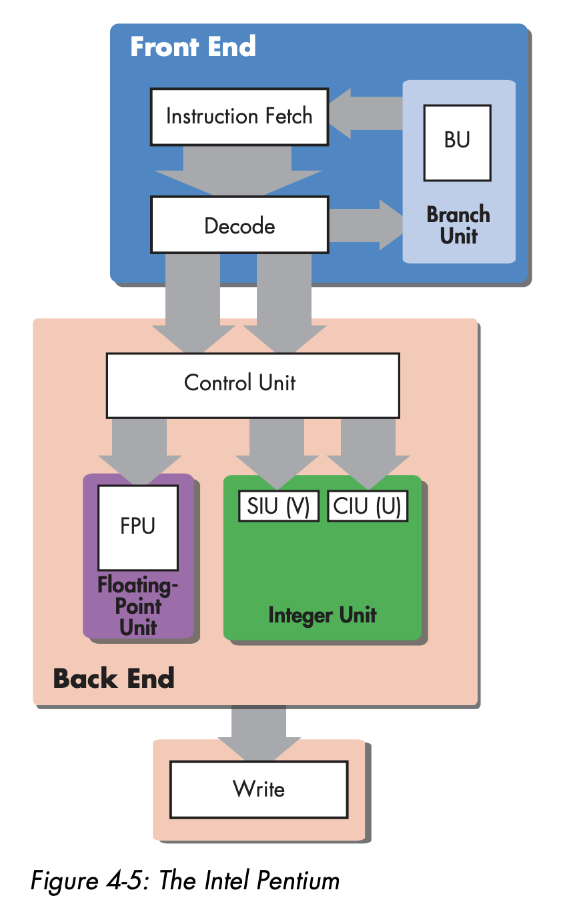
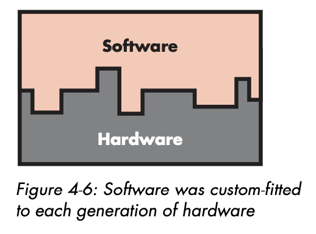
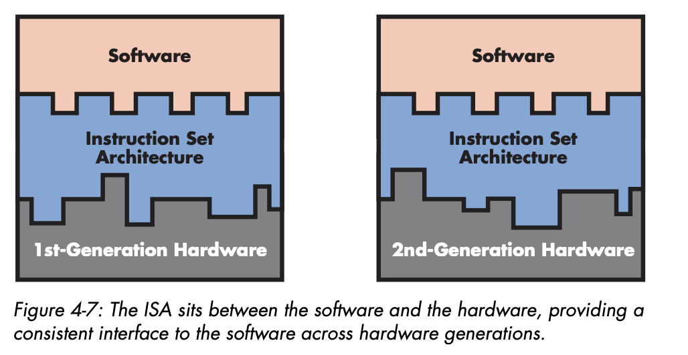
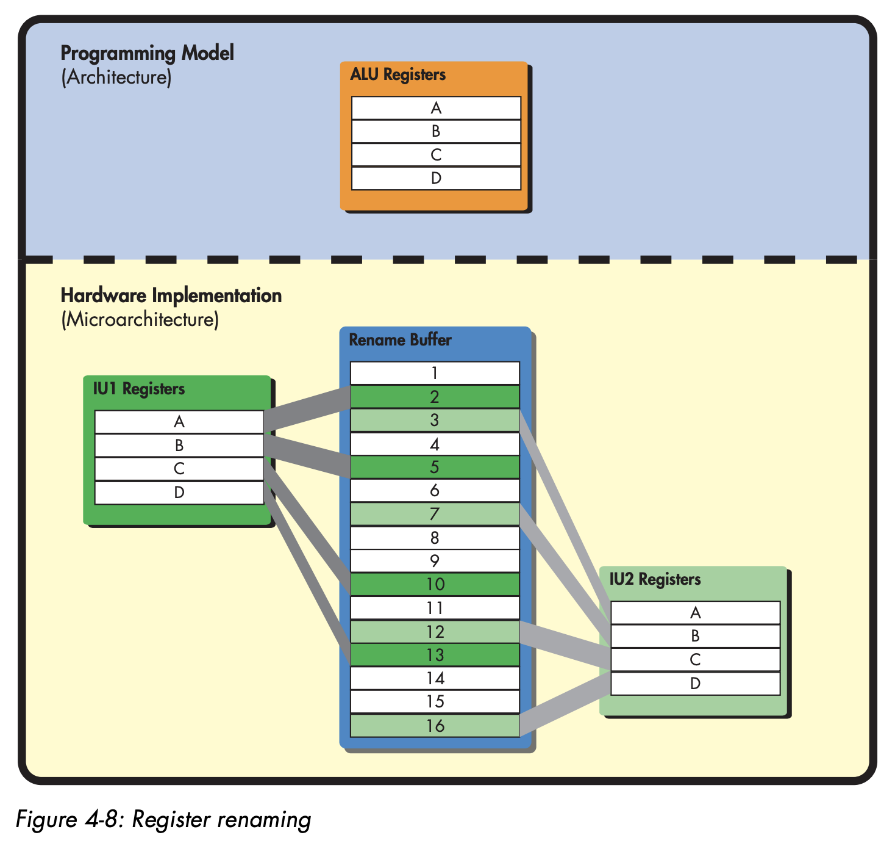

# Superscalar Execution

Let's introduce a two way superscalar version of DLW-1, which is DLW-2.

DLW-2 has two ALU, so it can execute two arithmetic instruction in parallel.

But it add complexity because it need new circuit.



Previously on second pipeline stage, it's called `decode`. Now we need to change the name into `decode / dispatch`.

This is because we need to dispatch circuitiry to determine is two instruction can be run paralelly.

That means, if this can be run parallel, dispatch unit will split those into two separate ALU.

If can't be run parallel, dispatch unit will decide to put it in 1 ALU ordered.



If processor can execute multiple instruction at once, that means process need to be able fetch multiple instruction at once too.

DLW-2 can fetch 2 instruction at once from memory in 1 clock cycle.

Fetching two instruction will complicates the way to deal branch instruction. What if the first instruction want to do jump? In this case second instruction got discarded

## Superscalar Computing and IPC

Superscalar allow microprocessor to increase the number instruction per clock.



## Expanding Superscalar Processing with Execution Units

### Basic Number Formats and Computer Arithmetic

The kind of number that processor can handle can be divided into 2, integer and floating number.

Both integer and floating number can be divided again into scalar and vector.

Scalar value can only have one number component.

Vector is multicomponent value.



That means, we will have 4 type of number.

- Scalar Integer
- Scalar Floating point
- Vector Integer
- Vector Floating point

The kind of operation we can do for these 4 types falls into 2 categories:

- Arithmetic Operation (addition, subtraction, multiplication, division)
- Logical Operation (AND, OR, NOT, XOR, bit shift, rotate) This can only done in scalar / vector integer.




### Arithmetic Logic Units

On early processor, all integer arithmetic and logical operation were handled by the ALU. Floating point is executed in companion chip, commonly called arithmetic coprocessor.



### Memory-Access Units

For memory access we have load-store unit and branch execution unit.

Load store unit is responsible for execution of load and store instruction, and also address generation.

Branch execution unit is responsible for condition and unconditional branching instruction.

## Microarchitecture and the ISA

### A Brief History of the ISA

Long time ago, IBM didn't build software compatible system. Instead, programmer should follow their architecture to be able to run the program.

That means, a working program in system A doesn't mean it can run in system B.



The problem with this, every time the new hardware comes, programmer must start from scratch to build the same program.

IBM solved this by releasing IBM system/360, it's introduced with ISA as layer of abstraction.

That means, programmer will just need to follow the ISA interface, and ISA will match the hardware implementation.



The middle layer on this image is called microcode engine.

Inside that engine, there will be a microcode program.

Microcode program will run to translate the instruction into something that can hardware understand.

When System/360 is executed
- Microcode unit read the instruction in
- Accessed the portion of microcode ROM where the instruction corresponding microcode program is located
- And then produces sequences of machine instructions

The main drawback of using microcode to implement an ISA is slower than direct decoding.

### Moving Complexity from Hardware to Software

RISC machine were able to get rid of microcode engine but still retaining benefit of ISA by moving complexity from hardware to software.

Because RISC ISA instruction is more limited, it's harder to write long program using assembly language for RISC processor.

## Challenges to Pipelining and Superscalar Design

There's some condition where two arithmetic cannot be safely dispatched in parallel, these conditions called hazzard.

- Data Hazzard
- Structural Hazzard
- Control Hazzard

### Data Hazards

Consider this program

```
#1 add A, B, C 
#2 add C, D, D
```

Because second instruction depends on first instruction, two instruction can't be executed simultaneously.

Rather, the first instruction need to finish first, so result C can be used in second.

Most pipelined processor can do trick called forwarding.

With forwarding processor will forward the first add result into ALU input port again, so no need to write to register.

That means, second add no need to wait for register C to be written.

Register renaming can do this trick also to overcome data hazzard.

It will make programmer think they only use 1 ALU.



### Structural Hazards

If you can see in here, nothing is wrong.
```
#15 add A, B, B 
#16 add C, D, D
```

But what if the A, B, C, D is actually in the same register group?

What if 1 register group can't accomodate two simultaneous writes?

This will cause structural hazzard.

### The Register File 

In superscalar design with multiple ALU, it's kinda impossible for each register connected to each ALU.

Because of that CPU register is grouped into special unit called register file.

This unit is actually array of memory. It has input port, output port and data bus.

That means, if register file want to simultaneously being written by 2 ALU, it should have 2 input port.

### Control Hazards

Also known as branch hazard.

This hazzard will arise when the processor arrives at conditional branch and has to decide which instruction to fetch next.

In old processor, pipeline can hang because it's waiting for condition to be evaluated.

Another potential problem is, when branch condition is evaluated, and next address is already fetched, that fetched instruction is wasted because we're not taking take path.

Making a latency to fetch the real instruction.